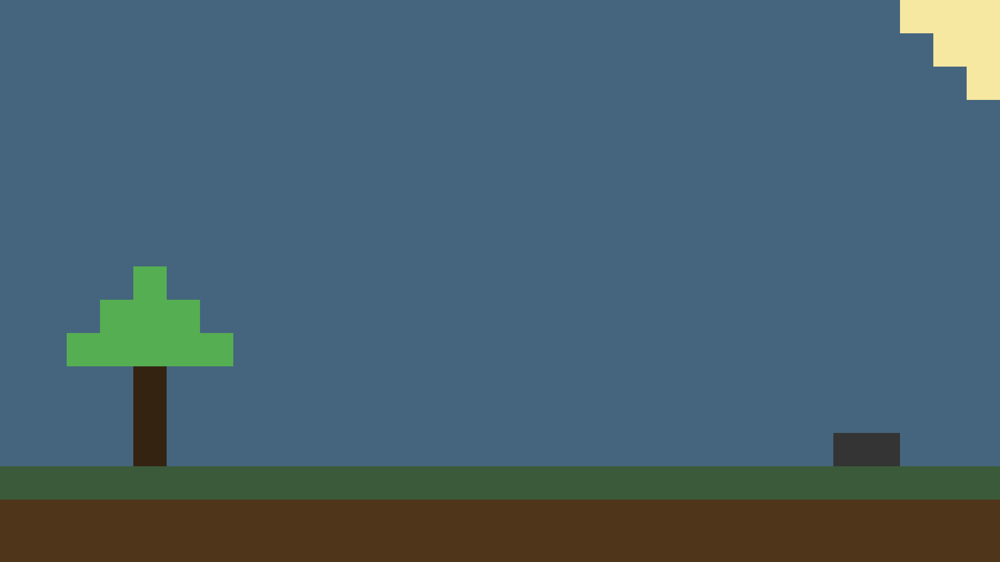

## project estruture
```
tilemap/
├── src/
│   ├── main.py
│   ├── tile.txt
├── assets/
│   ├── grass.png
│   ├── dirt.png
│   ├── wood.png
│   ├── leaf.png
│   ├── sky.png
│   ├── sun.png
│   ├── rock.png
```

## how it works
the map is generated from a text file (`src/tile.txt`), where each number represents a tile id.
each tile id is linked to an image defined in the tile dictionary inside the code.
all images are loaded from the `assets` folder.

## how to edit
### tile size
```python
tileSize = 64
```
this defines the pixel size of each tile in the map.

### tile system
each tile id is mapped to an image name:
```python
tile = {
    0: "grass",
    1: "dirt",
    2: "wood",
    3: "leaf",
    4: "sky",
    5: "sun",
    6: "rock",
}
```
rules:
* key is the id used in tile.txt
* value is the image name inside the assets folder (without .png extension)
* all images must be png files

### adding a new tile
* add a new image inside the assets folder
example:
`assets/lava.png`
* add it to the tile dictionary:
```python
tile = {
    0: "grass",
    1: "dirt",
    2: "wood",
    3: "leaf",
    4: "sky",
    5: "sun",
    6: "rock",
    7: "lava",
}
```
* use the id in `src/tile.txt`
example:
```
7 7 7 0 0 1
```

### editing the map

* edit `src/tile.txt` to change the map layout.

example:
```
0 0 0 1 1 1
0 0 0 1 1 1
2 2 2 2 2 2
```
rules:

* each row is one line
* values must be separated by spaces
* all ids must exist in the tile dictionary

### notes
* all assets must be inside the assets folder
* missing images will cause runtime errors
* tile size affects the entire rendering scale

## preview



## how to use

* clone the repository
```bash
git clone https://github.com/brenoprogrammer-hub/python_tilemap.git
```

* install dependencies
```bash
pip install pygame
```
* open the tilemap folder in a code editor (vscode or pycharm)

* run
```bash
python src/main.py
```
